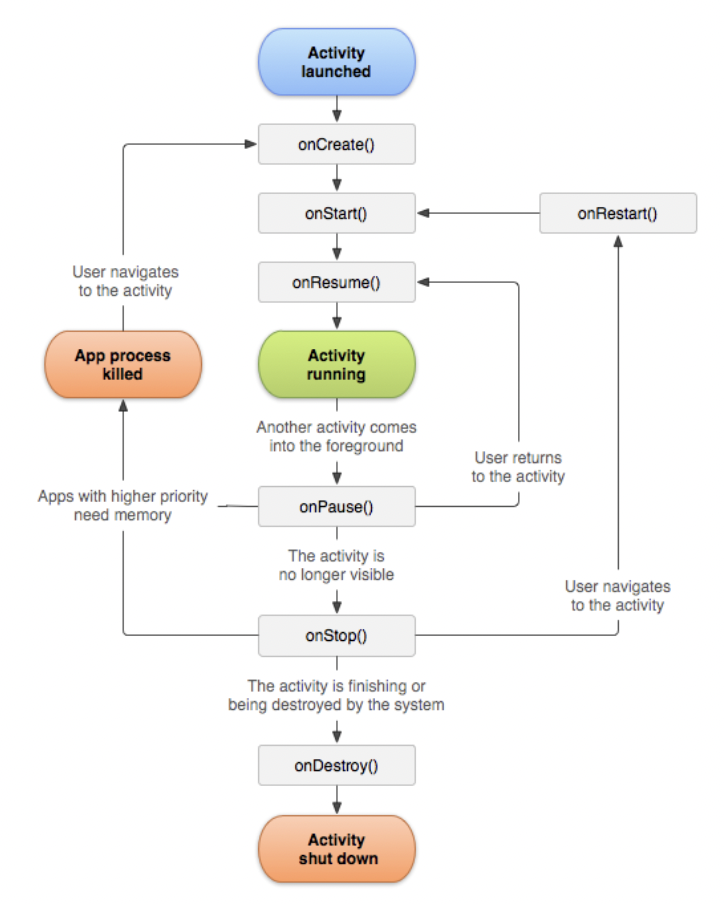

## Android Lifecycle Hooking

- Have seen this diagram when getting started with Android pentesting?



- Let's write a script and observe the lifecycle of each activity. 

```js
Java.perform(() => {

    const lifecycle_methods = ["onCreate", "onResume", "onPause", "onDestroy", "onStop"];

    var Activity = Java.use("android.app.Activity");

    lifecycle_methods.forEach(method => {

        try{
            Activity[method].overload("android.os.Bundle").implementation = function(bundle){
                console.log(`${this.getClass().getName()}.${method}`)
                return this[method](bundle);
            }

        }
        catch(e){
            try{
                Activity[method].overload().implementation = function(bundle){
                    console.log(`${this.getClass().getName()}.${method}`)
                    return this[method]();

            }}
            catch(e){
                console.log("Done")
            }

        }
    });


});
```
