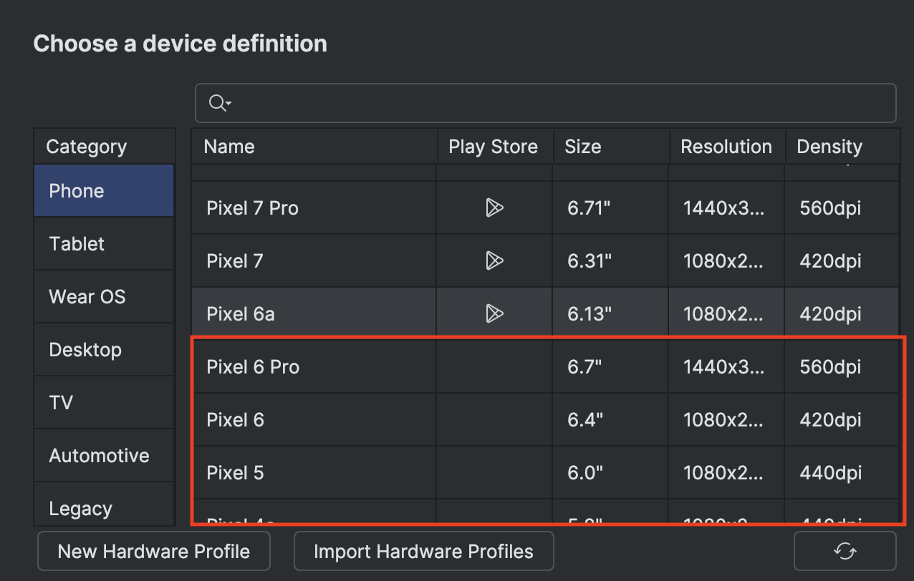

## Setup

### Prerequisites
- Download jadx-gui from [here](https://github.com/skylot/jadx/releases). Please setup and download java and jdk required for jadx too. 
- Download android studio and configure an emulator with API 28 or above
- Please refer the emulator setup guide [here](https://developer.android.com/studio/run/managing-avds). 
**Note: Download an emulator where there is not playstore icon in the playstore column as shown below**
 

- Check your cpu type using the following command - ``adb shell getprop ro.product.cpu.abilist``
- Download the frida-server according to your architecture of the emulator from [here](https://github.com/frida/frida/releases)
- Download frida-cli on your laptop using the following command
``pip install frida-tools``

## Setting up the environment
- Unzip the downloaded frida-server: ``unxz frida-server.xz``
- Restart the adb as root: ``adb root``
- Push the frida-server to device: ``adb push frida-server /data/local/tmp/``
- Give the permissions to execute: ``adb shell "chmod 755 /data/local/tmp/frida-server"``
- Start the frida server: ``adb shell "/data/local/tmp/frida-server &"``

### Check the setup:
- Run the following command to check if the environment was set properly:
``frida-ps -Uai``

## Download the APKs

[https://dlabs-training.s3.us-west-1.amazonaws.com/RootBeer.apk](https://dlabs-training.s3.us-west-1.amazonaws.com/RootBeer.apk)

[https://dlabs-training.s3.us-west-1.amazonaws.com/BugBazaar-latest.apk](https://dlabs-training.s3.us-west-1.amazonaws.com/BugBazaar-latest.apk)

[https://dlabs-training.s3.us-west-1.amazonaws.com/BugBazaar-latest.apk](https://dlabs-training.s3.us-west-1.amazonaws.com/Facebook.apk)